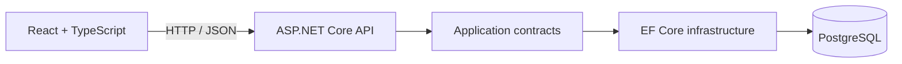

# Padel Trial Schedule

Виджет расписания первых пробных тренировок по паделу в формате турнирной ленты. Пользователь выбирает дату, город, станцию, тренера и формат, видит заполняемость группы и открывает подробности тренировки. Запись и оплата намеренно не реализованы согласно условию задания.


## Sample audit

This repository also includes a [sample .NET Backend & AI Readiness Audit](docs/sample-audit-report.md) with an architecture map, evidence-backed findings, priorities, and implementation estimates.

## Быстрый старт

Нужен только Docker Desktop.

```bash
docker compose up --build
```

После запуска приложение доступно на [http://localhost:18080](http://localhost:18080). На Windows можно просто запустить `run.cmd` двойным кликом.

Остановить приложение:

```bash
docker compose down
```

Данные PostgreSQL сохраняются в именованном Docker volume. Для полностью чистого запуска можно удалить volume отдельно: `docker compose down --volumes`.

## Что реализовано

- горизонтальная лента из 14 дат с переходом по неделям;
- фильтры по городу, станции, тренеру и формату;
- группировка карточек по тренерам;
- время, уровень, адрес и индикатор заполненности группы;
- окно подробностей без действий оплаты/записи;
- loading, empty и error states;
- адаптивная версия без горизонтального переполнения;
- доступные подписи элементов, keyboard focus и закрытие окна по `Escape`;
- PostgreSQL, EF Core migrations и идемпотентный demo seed;
- Problem Details, OpenAPI и health-check;
- multi-stage Docker image и запуск от непривилегированного пользователя;
- CI для backend, frontend и Docker-сборки.

## Архитектура



- `PadelTrialSchedule.Domain` — сущности и инварианты предметной области.
- `PadelTrialSchedule.Application` — DTO, запрос расписания и абстракции.
- `PadelTrialSchedule.Infrastructure` — EF Core, запросы, миграции и seed.
- `PadelTrialSchedule.Api` — HTTP API, обработка ошибок, health-check и раздача SPA.
- `PadelTrialSchedule.ClientApp` — React 19, TypeScript и Vite.
- `PadelTrialSchedule.IntegrationTests` — API с настоящим PostgreSQL через Testcontainers и domain-тесты.

Redis, RabbitMQ и Elasticsearch не добавлены осознанно: виджет выполняет небольшую read-only выборку, поэтому эти компоненты увеличили бы время старта и сложность эксплуатации без практической пользы. При росте нагрузки к запросу можно добавить distributed cache, не меняя публичный контракт API.

## API

`GET /api/v1/trial-schedule`

Поддерживаемые query-параметры:

| Параметр | Формат | Назначение |
|---|---|---|
| `dateFrom` | `yyyy-MM-dd` | Начало диапазона |
| `dateTo` | `yyyy-MM-dd` | Конец диапазона, максимум 32 дня |
| `cityId` | UUID | Город |
| `clubId` | UUID | Станция |
| `coachId` | UUID | Тренер |
| `type` | `Discovery`, `Fundamentals`, `GameIntroduction` | Формат |

Дополнительные адреса:

- `GET /health` — проверка приложения и PostgreSQL;
- `GET /openapi/v1.json` — OpenAPI-документ.

## Локальная разработка

Требования: .NET SDK 10, Node.js 20+ и Docker.

```bash
docker compose up -d postgres
dotnet run --project src/PadelTrialSchedule.Api
```

В другом терминале:

```bash
cd src/PadelTrialSchedule.ClientApp
npm ci
npm run dev
```

Vite проксирует `/api` и `/health` на `http://localhost:5080`.

## Проверки

Backend build и тесты:

```bash
dotnet test PadelTrialSchedule.sln --configuration Release
```

Frontend:

```bash
cd src/PadelTrialSchedule.ClientApp
npm run lint
npm run test
npm run build
```

Проверка production-сборки:

```bash
docker compose config --quiet
docker compose build
```

Интеграционные тесты автоматически поднимают изолированный `postgres:17-alpine`, применяют миграции, заполняют базу и проверяют API без зависимости от локальной БД.

