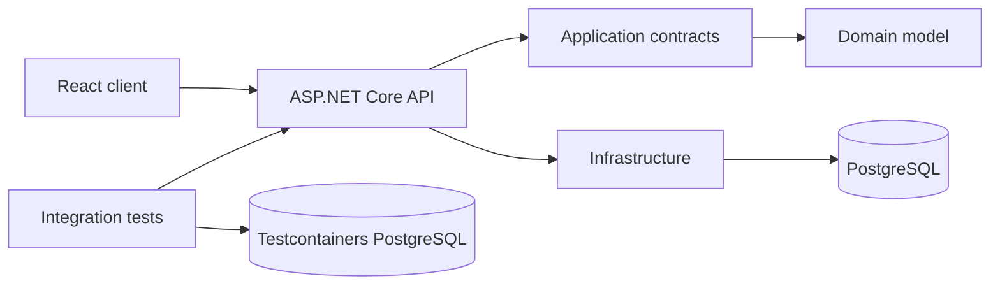

# Sample .NET Backend & AI Readiness Audit

> Demonstration report for this public repository. It shows the structure and level of evidence used in a client audit. It is not a penetration test, and the findings are intentionally limited to a repository-level review.

## Executive summary

PadelTrialSchedule is a small, well-structured ASP.NET Core application with clear project boundaries, reproducible Docker setup, integration tests against PostgreSQL, and an existing CI pipeline. The strongest risks are operational rather than architectural: production startup owns schema migration and demo seeding, local credentials are easy to copy into a real deployment, and static lookup data is queried repeatedly.

**Current assessment**

| Area | Assessment | Evidence |
|---|---|---|
| Architecture | Good | Domain, Application, Infrastructure, API, client, and tests have explicit boundaries |
| Data access | Good with optimization opportunity | Server-side projection, `AsNoTracking`, date/filter indexes, cancellation tokens |
| Reliability | Needs one production decision | Migration and demo seed execute in the API startup path |
| Tests and CI | Good | PostgreSQL Testcontainers tests plus backend, frontend, and Docker CI |
| Baseline security | Acceptable for a demo | No production secrets, non-root image, but reusable credentials are committed for local Docker |
| AI readiness | Good after remediation | `AGENTS.md`, deterministic commands, repository map, and automated verification |

## Architecture map

## Prioritized findings

### AUD-001 — Database migration and demo seed run inside every API startup

**Severity:** Medium  
**Category:** Reliability / deployment  
**Evidence:** `ScheduleDefinitions.ApplyDatabaseAsync` calls `MigrateAsync()` and then `DatabaseSeeder.SeedAsync()` before the request pipeline starts.

**Impact:** Multiple instances can race during rollout, the runtime identity needs schema-changing privileges, and a seed failure prevents the API from starting. The pattern is convenient locally but couples deployment concerns to the web process.

**Recommendation:** Move production migration to an explicit deployment job or one-shot migrator. Gate demo seeding behind a dedicated configuration flag and keep it disabled in production.

**Effort:** 0.5–1 day  
**Priority:** Fix next sprint

### AUD-002 — Local database credentials look production-ready

**Severity:** Medium  
**Category:** Configuration / security hygiene  
**Evidence:** `appsettings.json` and `docker-compose.yml` contain the same `postgres/postgres` credential pair.

**Impact:** The values are acceptable for an isolated demo, but copy-paste deployment can turn them into a real weak credential. The repository does not make the local-only boundary explicit at the configuration point.

**Recommendation:** Use `.env.example` placeholders in Compose, require the real `.env` locally, and leave the base application connection string empty. Document that production values must come from a managed secret store.

**Effort:** 1–2 hours  
**Priority:** Fix now

### AUD-003 — Static lookup collections are loaded on every schedule request

**Severity:** Low  
**Category:** Performance / API design  
**Evidence:** `TrialScheduleService.GetAsync` executes separate queries for cities, clubs, and coaches after loading sessions.

**Impact:** Every filtered schedule request performs four database round trips even though lookup data changes rarely. The effect is small at demo scale but grows directly with request volume.

**Recommendation:** Separate lookup metadata from schedule results or cache the lookup response with explicit invalidation. Measure before choosing in-process versus distributed caching.

**Effort:** 0.5 day  
**Priority:** Improve later

### AUD-004 — Health endpoint combines liveness and database readiness

**Severity:** Low  
**Category:** Operations  
**Evidence:** `/health` includes the `ScheduleDbContext` check and there is no separate liveness endpoint.

**Impact:** A temporary PostgreSQL outage can cause an orchestrator to restart otherwise healthy application processes, increasing pressure during an incident.

**Recommendation:** Expose `/health/live` without external dependencies and `/health/ready` with PostgreSQL. Configure the runtime platform to use the appropriate probe.

**Effort:** 1–2 hours  
**Priority:** Fix next sprint

### AUD-005 — Business timezone is a hard-coded fixed offset

**Severity:** Low  
**Category:** Correctness / maintainability  
**Evidence:** `TrialScheduleService` uses a static `TimeSpan.FromHours(3)` value.

**Impact:** The current Moscow use case works, but adding another region or changing the business timezone requires a code change and can make historical timezone behavior ambiguous.

**Recommendation:** Introduce a validated timezone option and convert through `TimeZoneInfo`. Add boundary tests around local midnight and the configured zone.

**Effort:** 0.5 day  
**Priority:** Improve later

### AUD-006 — Repository instructions for AI agents were missing

**Severity:** Informational  
**Category:** AI readiness  
**Evidence:** At the start of the audit, architecture constraints and verification commands existed only across README and project structure.

**Impact:** An AI coding agent had to infer boundaries and the definition of done, increasing the chance of cross-layer changes or incomplete verification.

**Recommendation:** Add a concise root `AGENTS.md` containing architecture boundaries, required commands, guardrails, and completion criteria.

**Effort:** 1 hour  
**Priority:** Resolved in this repository

## Recommended backlog

### Fix now

1. Replace committed reusable database credentials with explicit local placeholders.
2. Keep the new AI-agent instructions current when build or architecture rules change.

### Next sprint

1. Separate migration/seed execution from production API startup.
2. Split liveness and readiness probes.

### Later

1. Measure and reduce repeated lookup queries.
2. Make the business timezone configurable.
3. Add load-test thresholds once expected traffic is known.

## Positive controls worth preserving

- server-side EF Core projection with `AsNoTracking`;
- indexes aligned to time, club, and coach filters;
- cancellation tokens through the query path;
- integration tests against a real PostgreSQL container;
- multi-stage, non-root Docker image;
- backend, frontend, and Docker checks in CI;
- documented decision not to add Redis, RabbitMQ, or Elasticsearch without a demonstrated need.

## Suggested implementation sequence

1. Configuration hardening and separate health endpoints.
2. Deployment-safe migration and seed workflow.
3. Lookup-query measurement and caching decision.
4. Timezone abstraction only when a second region or schedule source is planned.

This sequence reduces operational risk first and avoids speculative architecture.

